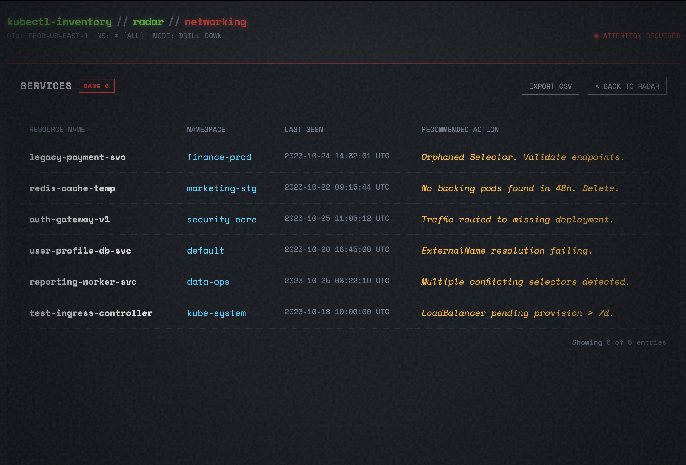
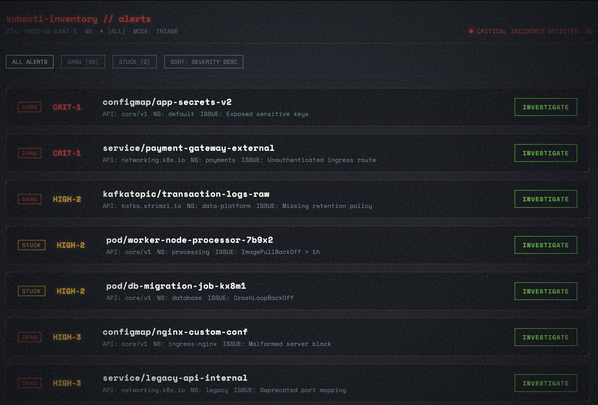
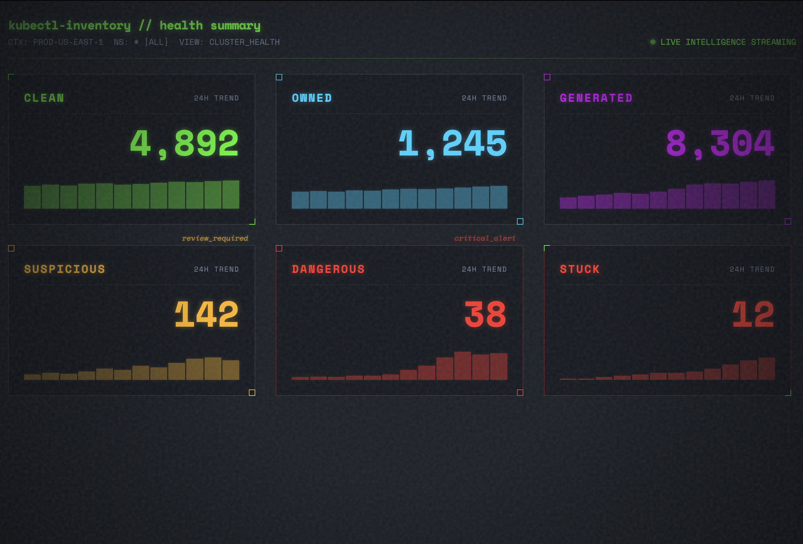
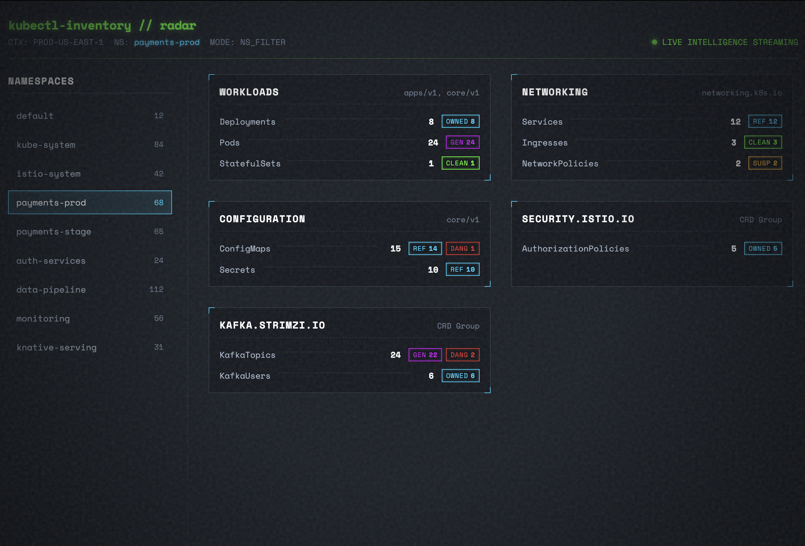

# kubectl-inventory

> **Because `kubectl get all` doesn't get all.**

[](https://github.com/shahneil76/kubectl-inventory/actions/workflows/ci.yml)
[](https://goreportcard.com/report/github.com/shahneil76/kubectl-inventory)
[](LICENSE)


A complete Kubernetes namespace inventory tool. Scans every API resource — including all CRDs — and classifies them by ownership, references, GitOps signals, and stuck finalizers.

Built for speed: a typical namespace scans in **~7s** using metadata-only fetching, with full analysis available via `--deep`.

```
Namespace: argocd   Context: prod-cluster
─────────────────────────────────────────────────────────────

Workloads
  Deployment   6
  StatefulSet  1
  ReplicaSet   6
  Pod          7

Networking
  Service        8
  Ingress        1
  NetworkPolicy  7
  EndpointSlice  8

Configuration
  ConfigMap  10  (suspicious: 2 ⚠)
  Secret      6  (suspicious: 3 ⚠)

Security
  ServiceAccount  8
  Role            6
  RoleBinding     6

argoproj.io
  AppProject      1
  Application    48
  ApplicationSet  2

external-secrets.io
  ExternalSecret  1

Stuck Resources
  None  ✓

Total resources:  140
Scanned:          186/198 resource types  (0 skipped by errors)
Noise profile:    6 resource types excluded  (use --include-noisy to scan all)
Duration:         7.8s
```

---

---

## Features

- **Complete inventory** — every API resource in a namespace, including all CRDs, grouped by API group
- **Suspicious orphan detection** — unowned, unmanaged, unreferenced resources flagged with reasons
- **Dangling owner refs** — resources whose owners no longer exist in the cluster
- **Stuck finalizer detection** — resources with `deletionTimestamp` set but finalizers blocking deletion
- **Reference graph** — Deployment → Secret/ConfigMap, Ingress → Service, HPA → Deployment, RoleBinding → ServiceAccount
- **GitOps signal detection** — ArgoCD, Helm, and Flux managed resources correctly classified as non-orphans
- **`explain` command** — per-resource classification report with owner chain, referrers, and confidence level
- **Owner tree** — full ownership tree output (`-o tree`)
- **Noise profile** — events, metrics, leases excluded by default (opt-in with `--include-noisy`)
- **Filters** — `--api-groups`, `--resources`, `--exclude-*`, `--selector`
- **Performance controls** — `--concurrency`, `--request-timeout`, `--deep`
- **Read-only** — only calls `List`; zero cluster-side installation
- **Web UI** — live cyberpunk dashboard with radar, health, dependency canvas, and drill-down views

---

## Web UI

Launch a live browser dashboard against your current cluster:

```bash
kubectl inventory web
```

This starts a local server on `http://localhost:8989` and opens your browser automatically. The UI scans all namespaces by default.

| Screen | Description |
|--------|-------------|
| **CONNECT** | Cluster context selector |
| **RADAR** | Real-time resource grid grouped by API group with signal chips |
| **NAMESPACES** | Filter the radar by namespace |
| **HEALTH** | Cluster health summary with signal breakdown and trend sparklines |
| **CANVAS** | Interactive dependency graph — owner-ref trees with SVG edges, click any node for details |

### Screenshots









### Canvas user flow

1. Click **CANVAS** in the nav — the server runs a BFS over owner-references and returns up to 40 connected resources
2. Nodes with owner-refs are laid out in depth columns (root resources on the left, leaves on the right)
3. Isolated resources appear in a 4-column grid
4. **Click any node** → detail panel opens showing namespace, age, status, incoming references
5. **COPY KUBECTL COMMAND** → copies `kubectl get <kind> <name> -n <ns> -o yaml` to clipboard
6. **DRILL INTO KIND** → switches to the full resource table for that kind
7. Scroll-wheel or `+`/`−` buttons to zoom; drag background to pan

---

## Installation

### Via Homebrew

```bash
brew tap shahneil76/kubectl-inventory
brew install kubectl-inventory
```

### Via krew

```bash
kubectl krew install inventory
```

> The plugin will appear in krew after the [PR to krew-index](https://github.com/kubernetes-sigs/krew-index) is merged.
> The krew manifest is [`inventory.yaml`](inventory.yaml) in this repo.

### Download binary

Grab the binary for your platform from [Releases](https://github.com/shahneil76/kubectl-inventory/releases) and place it anywhere in your `$PATH`.

```bash
# GoReleaser strips the 'v' prefix from the archive filename
TAG=v0.1.0
VER=0.1.0

# macOS arm64 (Apple Silicon)
curl -sL "https://github.com/shahneil76/kubectl-inventory/releases/download/${TAG}/kubectl-inventory_${VER}_darwin_arm64.tar.gz" \
  | tar -xz && mv kubectl-inventory /usr/local/bin/

# macOS amd64 (Intel)
curl -sL "https://github.com/shahneil76/kubectl-inventory/releases/download/${TAG}/kubectl-inventory_${VER}_darwin_amd64.tar.gz" \
  | tar -xz && mv kubectl-inventory /usr/local/bin/

# Linux amd64
curl -sL "https://github.com/shahneil76/kubectl-inventory/releases/download/${TAG}/kubectl-inventory_${VER}_linux_amd64.tar.gz" \
  | tar -xz && mv kubectl-inventory /usr/local/bin/

# Linux arm64
curl -sL "https://github.com/shahneil76/kubectl-inventory/releases/download/${TAG}/kubectl-inventory_${VER}_linux_arm64.tar.gz" \
  | tar -xz && mv kubectl-inventory /usr/local/bin/
```

Once `kubectl-inventory` is in your `$PATH`, it works automatically as a kubectl plugin:

```bash
kubectl inventory -n my-namespace
```

### Build from source

```bash
git clone https://github.com/shahneil76/kubectl-inventory
cd kubectl-inventory
make install  # go install ./...
```

---

## Usage

### Scan a namespace

```bash
kubectl inventory -n production
kubectl inventory -n production -o json
kubectl inventory -n production -o tree
kubectl inventory --all-namespaces
```

### Explain a resource

```bash
kubectl inventory explain pod/debug-net -n production
kubectl inventory explain secret/my-secret -n staging
kubectl inventory explain cm/app-config -n default
```

Example output:

```
pod/debug-net
─────────────────────────────────────────────────────────────

Identity
  Namespace:  production
  GVR:        /v1/pods
  Kind:       Pod
  UID:        a3f1c2d4-...
  Age:        14d
  Created:    2026-04-18T10:22:00Z
  Manager:    kubectl-run

Classification
  Status:     SUSPICIOUS
  Reasons:
    • no ownerReferences
    • no known GitOps/controller metadata detected
    • not referenced by scanned resources
    • created/managed by kubectl-run

Ownership
  ownerReferences: none

Referenced By
  not referenced by any scanned resource

Finalizers
  none
```

### Filter scans

```bash
# Only scan specific API groups
kubectl inventory -n prod --api-groups=apps,batch,networking.k8s.io

# Exclude noisy API groups
kubectl inventory -n prod --exclude-api-groups=metrics.k8s.io,events.k8s.io

# Only specific resource types
kubectl inventory -n prod --resources=pods,secrets,configmaps

# Label selector
kubectl inventory -n prod -l app=payment

# Include events (excluded by default)
kubectl inventory -n prod --include-events

# Include everything
kubectl inventory -n prod --include-noisy
```

### Performance tuning

```bash
# More concurrency (faster on high-QPS clusters)
kubectl inventory -n prod --concurrency 20

# Shorter per-GVR timeout (skip slow APIs faster)
kubectl inventory -n prod --request-timeout 5s

# Full spec for all types (enables complete reference analysis)
kubectl inventory -n prod --deep
```

### Other subcommands

```bash
# Show only suspicious orphan candidates with reasons
kubectl inventory orphans -n production

# Show only resources stuck behind finalizers
kubectl inventory stuck -n production

# Diff two namespaces
kubectl inventory diff -n staging -n production
```

---

## All Flags

```
  -n, --namespace string           Target namespace (default: current context namespace)
  -A, --all-namespaces             Scan all namespaces
  -o, --output string              Output format: table, json, tree (default "table")
      --include-system             Include kube-system and other system namespaces
      --age string                 Filter orphan resources older than duration (e.g. 30d, 7d, 24h)
      --no-color                   Disable color output

  # Filters
      --api-groups string          Comma-separated API groups to scan
      --exclude-api-groups string  Comma-separated API groups to exclude
      --resources string           Comma-separated resource names to scan
      --exclude-resources string   Comma-separated resource names to exclude
  -l, --selector string            Label selector (forwarded to every List call)

  # Noise profile
      --include-events             Include events (excluded by default)
      --include-metrics            Include metrics resources (excluded by default)
      --include-noisy              Include all noise-profile excluded resources

  # Performance
      --concurrency int            Max concurrent API list calls (default 10)
      --request-timeout string     Per-GVR request timeout (default "30s")
      --deep                       Fetch full object specs for all types

  # Kubeconfig
      --kubeconfig string          Path to kubeconfig
      --context string             Kubeconfig context to use
```

---

## Capabilities

| Feature | kubectl-inventory |
|---|:---:|
| Lists all resources (namespace + CRDs) | ✅ |
| API-group grouped summary | ✅ |
| Orphan / dangling owner ref detection | ✅ |
| Stuck finalizer detection | ✅ |
| Cross-resource reference graph | ✅ |
| GitOps signal detection (ArgoCD, Flux, Helm) | ✅ |
| `explain` command with owner chain | ✅ |
| Owner tree (`-o tree`) | ✅ |
| API-group / resource / label filters | ✅ |
| Metadata-first fast scan | ✅ |
| Per-GVR timeout | ✅ |
| JSON output | ✅ |
| Read-only, zero cluster-side install | ✅ |
| Web UI (`kubectl inventory web`) | ✅ |

See [PERFORMANCE.md](PERFORMANCE.md) for how the fast scan works.

---

## How It Works

1. **Discovery** — enumerates all API resources via `ServerPreferredResources`
2. **Filter** — applies noise profile, api-group/resource filters, scope filter
3. **Collect (fast)** — uses `PartialObjectMetadataList` for most types; full objects only for the 13 "deep Kinds" needed by the reference-walker (Pod, Deployment, Ingress, etc.)
4. **Analyze** — builds owner graph, reference graph, detects orphans/dangling/stuck
5. **Render** — table, tree, or JSON

See [PERFORMANCE.md](PERFORMANCE.md) for a detailed technical breakdown.

---

## Contributing

See [CONTRIBUTING.md](CONTRIBUTING.md). PRs welcome.

## License

[MIT](LICENSE)

## Support

[](https://ko-fi.com/xshahneil)

